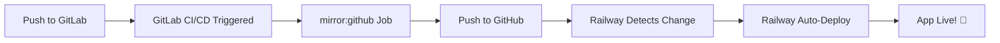

# 🔄 Auto-Mirror GitLab → GitHub → Railway

## 🎯 Workflow Otomatis

```
Push ke GitLab → GitLab CI/CD Mirror → GitHub Update → Railway Auto-Deploy! 🚀
```

**Keuntungan:**
- ✅ GitLab tetap jadi **source of truth**
- ✅ **Tidak perlu manual push** ke GitHub
- ✅ Railway **auto-deploy** dari GitHub
- ✅ **Fully automated** end-to-end!

---

## 📋 Setup Steps (One-time)

### Step 1: Buat GitHub Repository

1. Buka https://github.com/new
2. Buat repository baru:
   - Name: `ragam-bahasa-nusantara`
   - Public atau Private (terserah)
   - **JANGAN** initialize with README (biar kosong)
3. Copy repository URL:
   ```
   https://github.com/USERNAME/ragam-bahasa-nusantara.git
   ```

---

### Step 2: Buat GitHub Personal Access Token

1. Buka https://github.com/settings/tokens
2. Click **"Generate new token"** → **"Generate new token (classic)"**
3. Settings:
   - **Note**: `GitLab CI/CD Mirror`
   - **Expiration**: No expiration (atau sesuai kebutuhan)
   - **Scopes**: Centang `repo` (Full control of private repositories)
4. Click **"Generate token"**
5. **Copy token** yang muncul (hanya muncul sekali!)

---

### Step 3: Add GitLab CI/CD Variables

1. Buka GitLab project: https://gitlab.com/zuhryrahmani/ragam-bahasa-nusantara
2. Go to **Settings** → **CI/CD** → **Variables**
3. Click **"Add variable"**

**Variable 1: GITHUB_TOKEN**
- Key: `GITHUB_TOKEN`
- Value: `ghp_xxxxxxxxxxxxxxxxxxxx` (paste token dari Step 2)
- Type: Variable
- Environment scope: All
- Flags:
  - ✅ **Protected** (centang)
  - ✅ **Masked** (centang)
  - ❌ Expand variable reference (uncheck)

**Variable 2: GITHUB_REPO**
- Key: `GITHUB_REPO`
- Value: `USERNAME/ragam-bahasa-nusantara` (e.g., `faliqulfikri/ragam-bahasa-nusantara`)
- Type: Variable
- Environment scope: All
- Flags:
  - ✅ **Protected** (centang)
  - ❌ Masked (uncheck)

Click **"Add variable"** untuk masing-masing.

---

### Step 4: Test Mirror (Optional)

Push test commit ke GitLab:

```bash
# Make a small change
echo "# Test auto-mirror" >> README.md

# Commit
git add README.md
git commit -m "Test auto-mirror to GitHub"

# Push to GitLab
git push origin feature/integrated
```

**Check:**
1. GitLab CI/CD pipeline will run
2. `mirror:github` job will execute
3. Check GitHub repository - should be updated! ✅

---

### Step 5: Connect Railway to GitHub

1. **Buka Railway Dashboard**: https://railway.app/new

2. **Click "Deploy from GitHub repo"**

3. **Authorize GitHub** (jika belum)

4. **Select Repository**: `ragam-bahasa-nusantara`

5. **Configure Backend Service**:
   - **Root Directory**: `backend`
   - **Branch**: `feature/integrated` (atau `main`)
   - **Build Command**: Auto-detected (uses Dockerfile)
   - **Start Command**: Auto-detected

6. **Add Environment Variables** di Railway:
   - `SECRET_KEY`
   - `DATABASE_URL`
   - `DEBUG=False`
   - (See `.env.railway` for complete list)

7. **Add MySQL Plugin** (if needed):
   - Railway Dashboard → Add Plugin → MySQL

8. **Deploy!**
   - Railway will build and deploy
   - Get deployment URL

---

## 🔄 How It Works

### Automatic Workflow:



**Every time you push to GitLab:**

1. ✅ GitLab receives your push
2. ✅ GitLab CI/CD runs `mirror:github` job
3. ✅ Code automatically pushed to GitHub
4. ✅ Railway detects GitHub update
5. ✅ Railway automatically builds & deploys
6. ✅ Your app is live!

**You only maintain GitLab**, everything else is automatic! 🚀

---

## 📊 GitLab CI/CD Pipeline Stages

```
1. test (optional)
   ├─ test:backend - Run backend tests
   
2. mirror 
   ├─ mirror:github - Auto-push to GitHub ✨
   
3. deploy (manual) 
   └─ deploy:railway-cli - Manual Railway deploy via CLI
```

**Note:** Railway deploy via CLI is **manual** and **optional** because Railway will auto-deploy from GitHub anyway!

---

## 🔒 Security Notes

### GitLab Variables:

- `GITHUB_TOKEN` - **Masked & Protected** ✅
  - Never visible in logs
  - Only available on protected branches
  
- `GITHUB_REPO` - **Protected** ✅
  - Visible but only on protected branches

### Protected Branches:

Make sure your branches are protected:
1. GitLab → Settings → Repository → Protected branches
2. Add `main` and `feature/integrated` as protected

---

## ✅ Verification Checklist

After setup, verify:

- [ ] GitHub repository created
- [ ] GitHub Personal Access Token generated
- [ ] GitLab CI/CD variables added (`GITHUB_TOKEN`, `GITHUB_REPO`)
- [ ] `.gitlab-ci.yml` updated with mirror job
- [ ] Test push to GitLab → Check GitHub updated
- [ ] Railway connected to GitHub repository
- [ ] Railway auto-deploy working
- [ ] Environment variables set in Railway
- [ ] MySQL database configured (if needed)

---

## 🆘 Troubleshooting

### Mirror Job Fails - Authentication Error

**Error:** `fatal: Authentication failed`

**Solution:**
```
1. Check GITHUB_TOKEN is correct
2. Regenerate token if needed
3. Update GitLab CI/CD variable
```

### Mirror Job Fails - Repository Not Found

**Error:** `repository not found`

**Solution:**
```
1. Check GITHUB_REPO format: username/repo-name
2. Make sure GitHub repo exists
3. Token has repo access
```

### Railway Not Auto-Deploying

**Solution:**
```
1. Check Railway → Settings → Deployments
2. Verify "Auto-Deploy" is enabled
3. Check correct branch is selected
4. Verify GitHub webhook is active
```

### GitHub Token Expired

**Solution:**
```
1. Generate new token: https://github.com/settings/tokens
2. Update GITHUB_TOKEN in GitLab CI/CD Variables
```

---

## 💡 Pro Tips

### 1. Protect Your Branches

```
GitLab → Settings → Repository → Protected branches
- Add: main, feature/integrated
```

This ensures mirror job only runs on important branches.

### 2. Branch-Specific Mirroring

Current setup mirrors `main` and `feature/integrated`. To add more:

```yaml
mirror:github:
  only:
    - main
    - feature/integrated
    - develop  # Add more branches
```

### 3. Staging vs Production

**For staging:**
```yaml
mirror:github-staging:
  script:
    - git push github HEAD:staging --force
  only:
    - develop
```

Railway can watch different branches for staging/production.

### 4. Skip CI on Mirror Commits

To avoid infinite loops, mirror job uses:
```yaml
tags:
  - docker
```

Make sure your GitLab runner has this tag.

---

## 📈 Monitoring

### Check Mirror Status:

```
GitLab → CI/CD → Pipelines → mirror:github job
```

### Check Railway Deploy:

```
Railway Dashboard → Deployments → View Logs
```

### GitHub Sync Status:

```
Compare GitLab and GitHub commits:
- GitLab: https://gitlab.com/zuhryrahmani/ragam-bahasa-nusantara/-/commits/feature/integrated
- GitHub: https://github.com/USERNAME/ragam-bahasa-nusantara/commits/feature/integrated
```

---

## 🎯 Complete Example Flow

```bash
# 1. Make changes locally
vim backend/app/main.py

# 2. Commit changes
git add .
git commit -m "Update backend API"

# 3. Push to GitLab (ONLY this step needed!)
git push origin feature/integrated

# 4. GitLab CI/CD automatically:
#    - Runs tests (if configured)
#    - Mirrors to GitHub
#
# 5. Railway automatically:
#    - Detects GitHub update
#    - Builds Dockerfile
#    - Deploys new version
#
# 6. Your app is updated! 🎉
```

**You only do step 1-3. Everything else is AUTOMATIC!** ✨

---

## 🔗 Quick Links

- **GitLab Project**: https://gitlab.com/zuhryrahmani/ragam-bahasa-nusantara
- **GitLab CI/CD**: https://gitlab.com/zuhryrahmani/ragam-bahasa-nusantara/-/pipelines
- **GitHub Settings**: https://github.com/settings/tokens
- **Railway Dashboard**: https://railway.app/dashboard

---

## 📝 Summary

**What You Setup:**
1. ✅ GitHub repository (mirror)
2. ✅ GitHub Personal Access Token
3. ✅ GitLab CI/CD Variables
4. ✅ Railway connected to GitHub

**What Happens Automatically:**
1. ✅ Push to GitLab → Auto-mirror to GitHub
2. ✅ GitHub update → Railway auto-deploy
3. ✅ App deployed! 🚀

**What You Do:**
```bash
git push origin feature/integrated
# That's it! ✨
```

---

**Status:** Ready to setup! 🎯

**Next Step:** Follow Step 1-5 above to complete setup.
